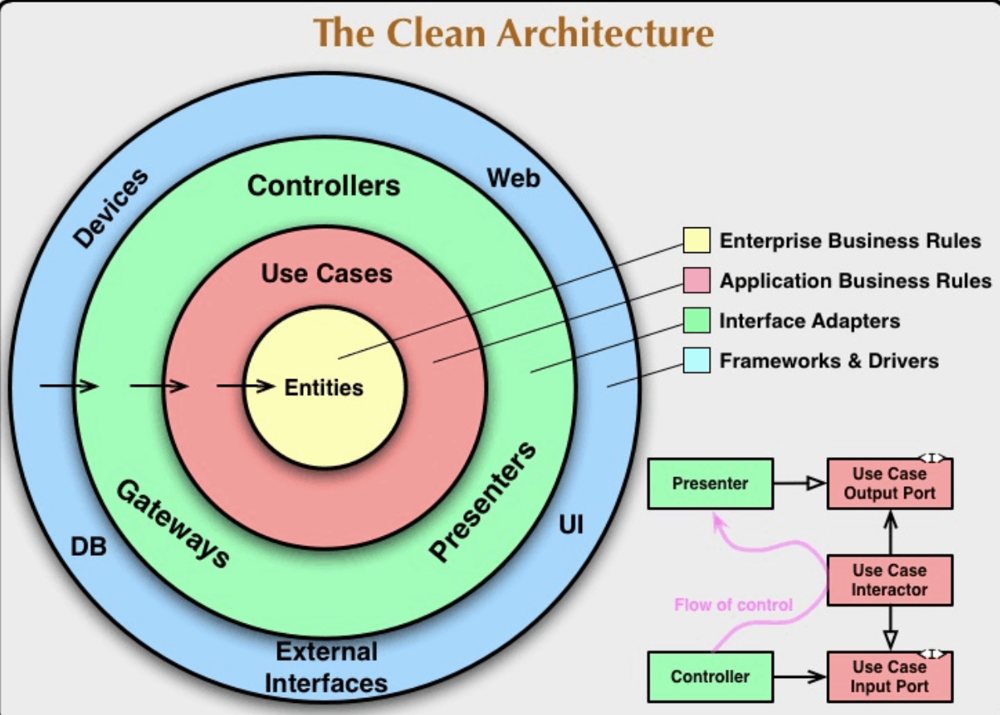

# クリーンアーキテクチャ

## クリーンアーキテクチャーとは

### 概要

機能を実現しているコアな部分をフレームワークや DB などに依存しない状態で他の部分が変わってもコアな部分への影響をなくして変更や拡張に強くすることができるアーキテクチャー

### 嬉しい部分

- 既存機能の改修
  - 改修場所を特定しやすい
  - 他の影響を減らせる
- 新規機能の開発
  - 既存の処理を利用しやすい
  - 他への影響を減らせる
  - テストコードが書きやすい
- バグ修正
  - 原因、修正方法特定しやすい

## よく見るクリーンアーキテクチャの図

上記の図を階層ごとにまとめる

### `EnterPrise Business Rules`

- システムの中枢となる層
- ビジネスルールをカプセル化
- `domein`や`entity`と呼ばれる
- ビジネスルールとはシステムのルールや手続き
  - 店を例に挙げると商品、カート、注文、ユーザ
- 各ドメインができることだけを記述していくようなイメージ

### `Application Business Rules`

- `usecase`と称される領域
- システムとしてのビジネスルールが実装される
  - ユーザ情報を保存する機能の場合は「値が全て正常かどうかを調べてユーザを更新か生成」
- `usecase`は`domain`に依存
- `Interface Adapters`などの外側の層には依存しない

### `Interface Adapters`

- 入力、永続化、表示などの外部世界とのやり取りを担当するものが当てはまる
- `Interface Adapters`の領域は`getways`、`controller`、`presenter`の 3 つである
- `getways`
  - データの取り扱いに関する抽象化担当
- `controller`
  - 入力値を`usecase`に渡す
  - レスポンスを返す橋渡し
- `presenter`
  - 入力値/出力値を変換する
  - 入力に関しては`usecase`が扱いやすい形に変換
  - 出力にしては外部が扱いやすい形に変換
- `Frameworks` & `Drivers`
  - 一番外の層
  - DB やフレームワークに依存するコードが配置される

## 参考文献

- [文献 1](https://zenn.dev/tis1116/articles/6c5416e5d77dbf)
